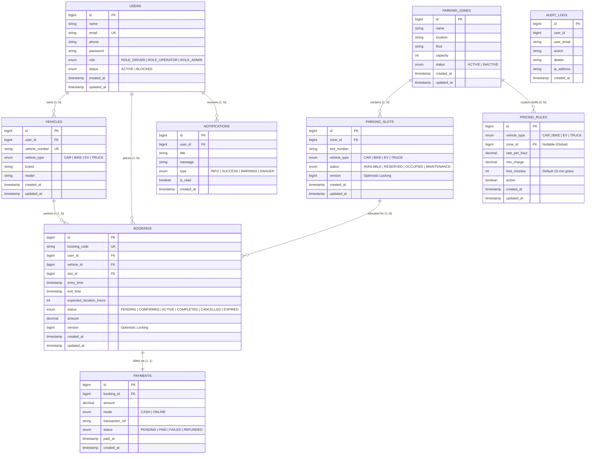

# SmartPark - Entity Relationship Diagram

```mermaid
erDiagram
    USERS ||--o{ VEHICLES : "owns (1..N)"
    USERS ||--o{ BOOKINGS : "places (1..N)"
    USERS ||--o{ NOTIFICATIONS : "receives (1..N)"
    PARKING_ZONES ||--o{ PARKING_SLOTS : "contains (1..N)"
    PARKING_ZONES ||--o{ PRICING_RULES : "custom tariffs (0..N)"
    PARKING_SLOTS ||--o{ BOOKINGS : "allocated for (1..N)"
    VEHICLES ||--o{ BOOKINGS : "parked in (1..N)"
    BOOKINGS ||--|| PAYMENTS : "billed via (1..1)"

    USERS {
        bigint id PK
        string name
        string email UK
        string phone
        string password
        enum role "ROLE_DRIVER | ROLE_OPERATOR | ROLE_ADMIN"
        enum status "ACTIVE | BLOCKED"
        timestamp created_at
        timestamp updated_at
    }

    VEHICLES {
        bigint id PK
        bigint user_id FK
        string vehicle_number UK
        enum vehicle_type "CAR | BIKE | EV | TRUCK"
        string brand
        string model
        timestamp created_at
        timestamp updated_at
    }

    PARKING_ZONES {
        bigint id PK
        string name
        string location
        string floor
        int capacity
        enum status "ACTIVE | INACTIVE"
        timestamp created_at
        timestamp updated_at
    }

    PARKING_SLOTS {
        bigint id PK
        bigint zone_id FK
        string slot_number
        enum vehicle_type "CAR | BIKE | EV | TRUCK"
        enum status "AVAILABLE | RESERVED | OCCUPIED | MAINTENANCE"
        bigint version "Optimistic Locking"
        timestamp created_at
        timestamp updated_at
    }

    BOOKINGS {
        bigint id PK
        string booking_code UK
        bigint user_id FK
        bigint vehicle_id FK
        bigint slot_id FK
        timestamp entry_time
        timestamp exit_time
        int expected_duration_hours
        enum status "PENDING | CONFIRMED | ACTIVE | COMPLETED | CANCELLED | EXPIRED"
        decimal amount
        bigint version "Optimistic Locking"
        timestamp created_at
        timestamp updated_at
    }

    PAYMENTS {
        bigint id PK
        bigint booking_id FK
        decimal amount
        enum mode "CASH | ONLINE"
        string transaction_ref
        enum status "PENDING | PAID | FAILED | REFUNDED"
        timestamp paid_at
        timestamp created_at
    }

    PRICING_RULES {
        bigint id PK
        enum vehicle_type "CAR | BIKE | EV | TRUCK"
        bigint zone_id FK "Nullable (Global)"
        decimal rate_per_hour
        decimal min_charge
        int free_minutes "Default 15 min grace"
        boolean active
        timestamp created_at
        timestamp updated_at
    }

    NOTIFICATIONS {
        bigint id PK
        bigint user_id FK
        string title
        string message
        enum type "INFO | SUCCESS | WARNING | DANGER"
        boolean is_read
        timestamp created_at
    }

    AUDIT_LOGS {
        bigint id PK
        bigint user_id
        string user_email
        string action
        string details
        string ip_address
        timestamp created_at
    }
```
